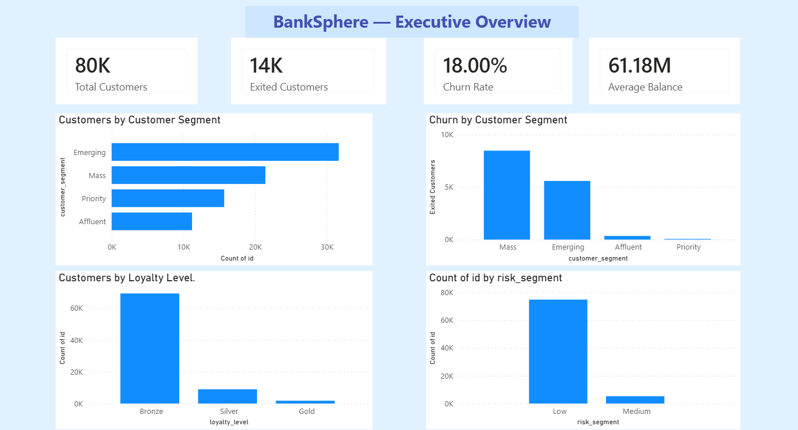
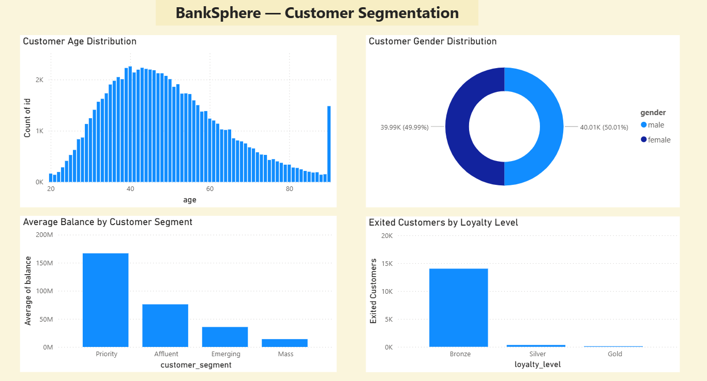
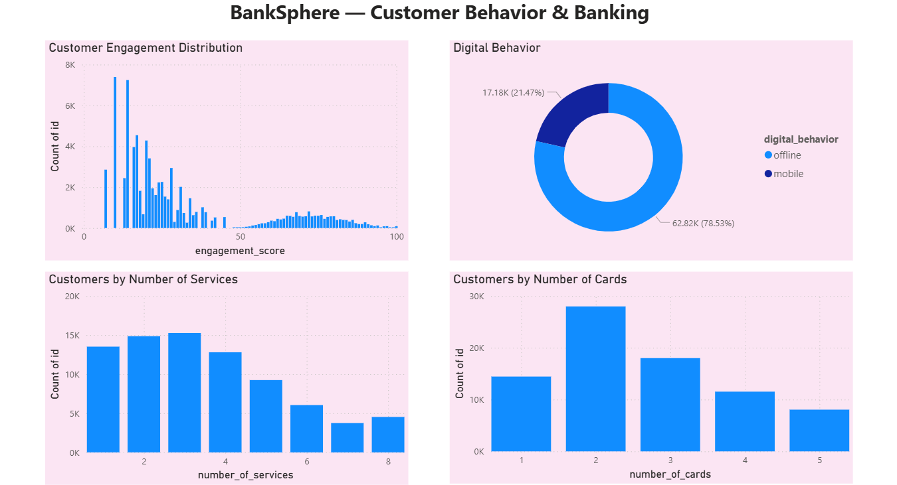
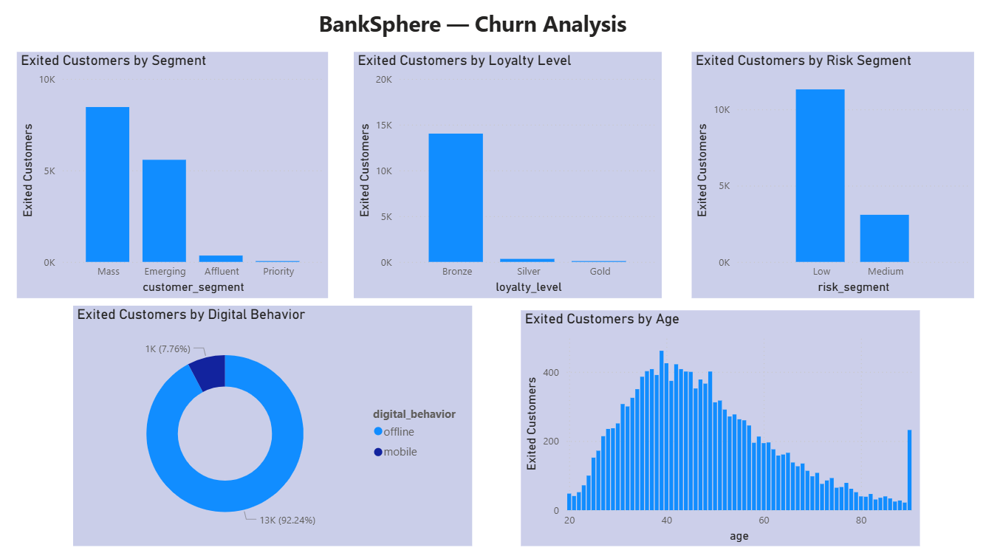

# BankSphere – Customer & Banking Analytics

An end-to-end banking analytics project focused on understanding customer behavior, segmentation, engagement, and churn using Python, MySQL, and Power BI.

## 📌 Project Overview

BankSphere analyzes **80,000 simulated banking customer records** to understand customer behavior, identify customer segments, analyze engagement, and study customer churn.

The project follows an end-to-end data analytics workflow:

**Data Preparation → Python → MySQL → SQL Analysis → Power BI Dashboard**

---

## 🎯 Business Objectives

The project focuses on answering key business questions:

- What is the overall customer churn rate?
- How many customers have exited the bank?
- How does churn vary across customer segments?
- How does customer engagement relate to churn?
- How does loyalty level vary across customers?
- How does digital behavior differ among customers?
- Which risk segments contain more exited customers?
- How do customer demographics and financial characteristics vary across segments?
- How do banking services and card ownership relate to customer behavior?

---

## 🛠️ Tools & Technologies

- **Python**
- **Pandas**
- **MySQL**
- **SQL**
- **Power BI**
- **Git & GitHub**

---

## 📊 Dataset

**Bank Customer Behavior and Churn Dataset**

- **Records:** 80,000
- **Original columns:** 26
- **Cleaned columns:** 24
- **Data:** Simulated banking customer data

Dataset source:

[Bank Customer Behavior and Churn Dataset – Kaggle](https://www.kaggle.com/datasets/thuandao/bank-customer-behavior-and-churn-dataset)

---

## 🔄 Data Preparation

Python and Pandas were used to prepare the dataset for analysis.

Key steps included:

- Inspected dataset structure and data types
- Checked for missing values
- Checked for duplicate records
- Renamed unclear column names
- Converted date columns into proper date formats
- Removed unnecessary personal information such as name and address
- Created a cleaned dataset
- Prepared a MySQL-ready dataset

---

## 🗄️ SQL Analysis

The cleaned dataset was loaded into MySQL for structured analysis.

A SQL view was created to support business analysis and derive categories such as:

- Age Group
- Income Group
- Tenure Group
- Engagement Group
- Customer Status

Analysis was performed across:

- Customer churn
- Customer segments
- Loyalty levels
- Customer engagement
- Digital behavior
- Risk segments
- Age groups
- Number of services
- Number of cards
- Customer balance
- Geographic distribution

---

## 📈 Power BI Dashboard

The Power BI dashboard contains four analytical pages.

### 1. Executive Overview

Provides a high-level view of:

- Total Customers
- Exited Customers
- Churn Rate
- Average Balance
- Customer Segment
- Loyalty Level
- Risk Segment
- Churn by Customer Segment

### 2. Customer Segmentation

Analyzes:

- Age distribution
- Gender distribution
- Average balance by customer segment
- Exited customers by loyalty level

### 3. Customer Behavior & Banking

Analyzes:

- Customer engagement
- Digital behavior
- Number of banking services
- Number of cards

### 4. Churn Analysis

Provides detailed analysis of exited customers across:

- Customer segment
- Loyalty level
- Risk segment
- Digital behavior
- Age groups

---

## 🖼️ Dashboard Preview

### Executive Overview



### Customer Segmentation



### Customer Behavior & Banking



### Churn Analysis



---

## 📁 Project Structure

```text
BankSphere-Banking-Analytics/
│
├── python/
│   ├── 01_data_inspection.py
│   ├── 02_data_quality_check.py
│   ├── 03_data_cleaning.py
│   └── 04_mysql_export.py
│
├── sql/
│   └── 01_create_bank_customers.sql
│
├── powerBI/
│   └── BankSphere_Banking_Analytics.pbix
│
├── screenshots/
│   ├── 01_executive_overview.png
│   ├── 02_customer_segmentation.png
│   ├── 03_customer_behavior.png
│   └── 04_churn_analysis.png
│
└── README.md
